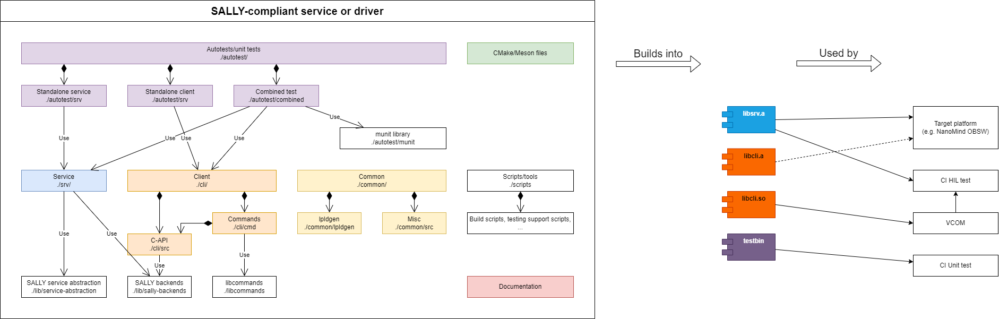

# Component Driver Template
This repository contains the template project to be used for implementation of drivers for various flight hardware procured from 3rd parties, or internally developed - reaction wheels, gyroscopes, or full subsystems.

Rationale is to create a unified driver structure that enables various levels of hardware- and software-in-the-loop testing.

## Structure

* **autotest/**: Sources of autotest binaries. These will be run in CI.
  * **autotest/cli**: Sources for standalone client.
  * **autotest/srv**: Sources for standalone server. When built, the server can be run as a standalone program that can be commanded by the client.
  * **autotest/comb**: Combined binary running both client and server, primarily serving as testbed for unit tests.
  * **autotest/munit**: The unit test library, munit: https://github.com/nemequ/munit
* **build/**: Output from running build scripts - mainly statically linked libraries for the driver client and server. Different targets are in directories named `<build-class>-<build-platform>`, e.g. `server-Linux` is the driver server built for the Linux platform.
* **cli/**: The driver client source and headers. See [Driver client](#driver-client) section for details.
* **common/**: Source code and headers common to both client and server. May also contain lpldgen definitons and generated code, if the device is compatible with CSP.
* **doc/**: Documentation, preferably generated from source code by Doxygen.
* **lib/**: Libraries common to client, server and autotests.
* **scripts/**: Compilation and other helper scripts.
* **srv/**: The driver server source and headers. See [Driver server](#driver-server) section for details.

The overall structure is also summarized in the diagram below.

## Driver client
This software interfaces with the target device to be controlled. The target device can be one of the following:

1. Real device - the exact unit that is to be used in flight. For example, a complete reation wheel including motor, full mass flywheel etc.
2. Hardware emulator - device with electrical interface matching the real device, but with limited performance/functionality. For example, this may be an incomplete reaction wheel without motor, or just a microcontroller implementing the communication interfaces and running reaction wheel firmware. At this level, the same physical interface is used for communication (e.g. RS-485 UART) as with the real hardware. However, the emulator may behave differently under some circumstances. For example, reaction wheel hardware emulator without motor will not experience issues with incorrectly configured motor driving.
3. Software emulator - completely software implementation/mock of the target hardware. 

The client tyically contains at least two parts: a C-API which exposes simple functions that can be called to access the functionality (`cli/src`) and commandline commands for integration to e.g. VCOM (`cli/cmd`).

For information about individual functions of the client see [client.h](./client_8h.html)

## Driver server
This software is the counterpart of the driver client. When implementing a driver for a COTS components, the "server" is the real device. However, for the purposes of early development and testing in CI or against emulators, it is advantageous to implement the server as well.

Internally developed devices should be running this server, so that the software that's being tested by the CI is the same.

For information about individual functions of the server see [server.h](./server_8h.html)

## Compilation and output files
Compilation is performed by `scripts/build.sh`. For convenience, a Makefile is provided to serve as a launcher for the various scripts.

To compile the driver, you must select build `class` and `platform`. Build `class` can be either `server`, `client` or `combined` (for autotesting purposes), while build `platform` specifies a platform (e.g. Linux, STM32) etc. If you want to add support for a new platform, you have to add the appropriate configuration to `CMakeLists.txt`. The sample file in this repository contains a single build `platform` called `Linux`.

The output of compilation are typically two statically linked libraries of the client and server located in `build/` generated by CMake. In addition, if `BUILD_AUTOTEST` is enabled in CMake, executable binaries for the selected platform will be generated based on sources in the `autotest` directory. Those binaries can then be run to verify functionality of the client and server.

It is also possible to build the client as a dynamically linked library. This is typicaly used when the client is used as a commandline plugin into VCOM. To do this, `BUILD_SHARED` must be enabled in CMake. Keep in mind that when building a shared library, all its dependencies must be built shared as well!

When building client with commandline control, `BUILD_CMDLINE` must be enabled in CMake.

## Abstraction layers
The driver client and software may run on various platforms - at least the developer PC, CI dockers and target flight platforms are foreseen. Therefore, it is necessary to use abstraction layers to decouple the implementations from specific hardware or OS.

To abstract filesystem, OS operations and COM ports, the [SALLY abstraction](https://gitlab.com/vzlu/sw/sally) layer may be used. Currently implemented backends may be found in [this repository](https://gitlab.com/vzlu/sw/sally-backends).

## Using this template
To use this template:
1. Fork it into the relevant GitLab namespace/group.
2. Follow the steps highlighted in the CMake file (set the name, create all arelevant configurations etc.).
3. Add your client and service implementations and headers. It is important to keep consistent naming for the headers, e.g. public headers for DataKeeper client should be in `cli/include/dk`. The same applies for server and common files.
4. Make sure that everything which is common to both client and the server is kept in `common`. Tyically, this includes lpldgen definitions and generated files, communication interface definitions, device-specific checksum calculations etc.
5. Write tests - at least the combined unit test for each client-side command that is implemented.
6. Add the driver as a submodule to the relevant projects - typically this will be at least VCOM and the on-board software. From this higher-level project's CMake, configure all the options and then use the client/server libraries in its code, either by using the client C-API/commands, or by creating the service by using SALLY.

## Documenting the driver
This template also comes with a doxyfile

To automatically generate documentation for the repo, run `doxygen` in your commandline
This documentation should serve as a template for your for of the driver template.